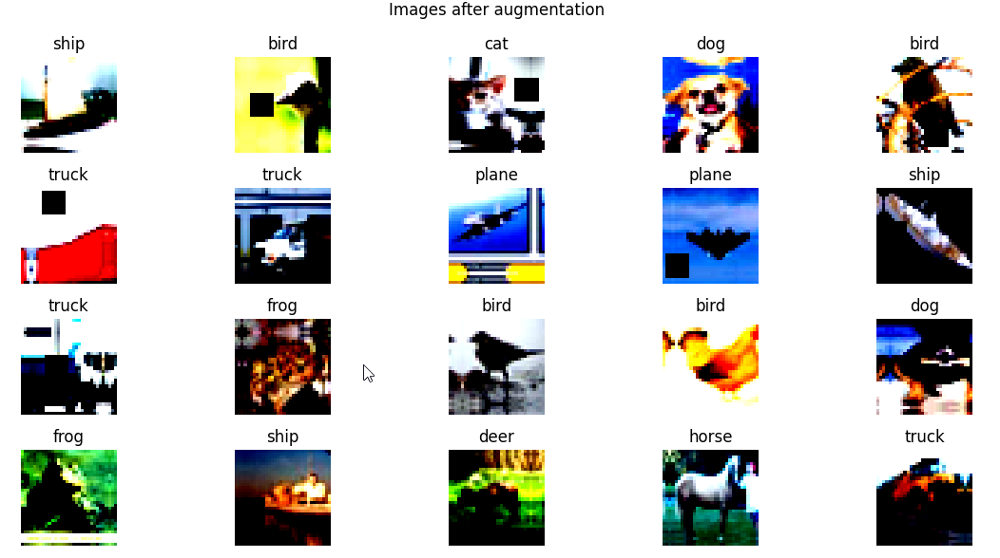

# ERA_V1 Assignment 10
The objective of the assignment is to acheive 90% accuracy on CIFAR 10 dataset in 24 epochs using OneCycleLR Policy

-  Architecture
   -  The model used for training is ResNet18.
  
   -  Model Summary

       

-  Data Augmentation
   -  Albumentation Library is used to apply transforms to the data
   -  Transforms applied are: RandomCrop of (32, 32) after padding of 4 >> FlipLR >> Followed by CutOut(8, 8)
   -  Images after augmentation
  

 
-  Learning Rate
   -  The maximum learning was found using the LRFinder library.
  

   -  The LR was then set to achieve its maximum at 5th epoch
  

-  Loss and Accuracy
   -  The model acheives the target of 90% test accuracy at 24th epoch
  

   -  Comparison of train and test loss and accuracy
  

   -  Misclassified Images
  

  -  GradCam Images
  

